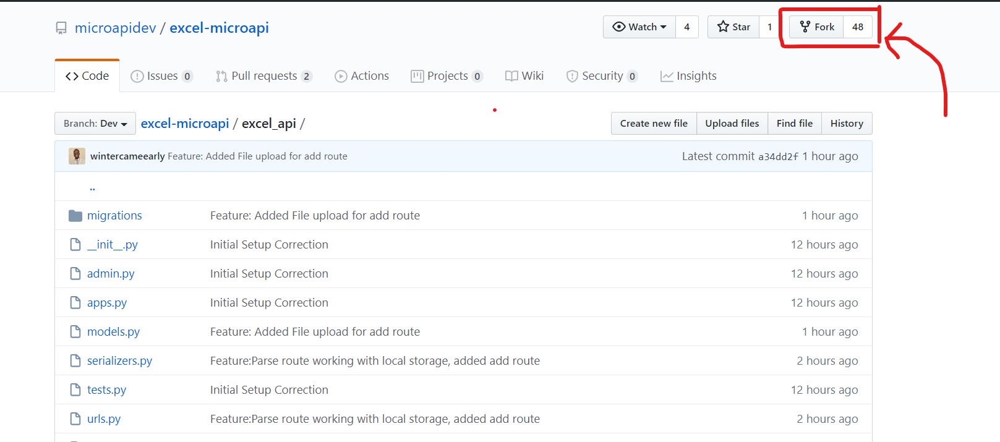

# Excel MicroAPI

This is a Microservice for managing Excel files
<br/>

It runs on the Django Framework, supported by Django Rest Framework

# Setting Up / Installation


## Step 1:
### Clone the project
```bash
git clone https://github.com/microapidev/excel-microapi
cd excel-microapi
```

## Step 2:
### Create and activate a Python Virtual Environment

```python
python -m venv venv
```
#### To activate the environment for Windows:

```python
.\venv\Scripts\activate
```

#### To activate the environment for Mac/Linux:

```python
source venv/bin/activate
```

## Step 3:
### Install the Libraries needed

```python
pip install -r requirements.txt
```
## Step 4:
### Start Server:
```python
python manage.py migrate
python manage.py runserver
```


# Contributing
**If you are going to be making changes or adding features to this Project please do the following:**

 - ### Clone the Project
    Clone the project, if you have not done so, see [here](#step-1)

- ### Fork this repository
   **Create a Fork**. Here is how to:

    

  Keep track of the URL to the forked repository.
  It should usually be something like:

   **`https://github.com/<your_github_username>/excel-microapi`**

- ### Update the Push url for the local repo on your machine
-
  ```bash
  git remote origin set-url --push <insert forked url here>
  ```

    example:
  ```bash
  git remote origin set-url --push https://github.com/mark/excel-microapi
  ```


 - ### Create a new Branch with the feature name
      First pull the recent changes changes before creating a branch

     ```bash
      git pull
      git branch <feature_i_want_to_add>
     ```

     Work on your new changes and then push to your branch
    ```bash
    git push -u origin <feature_i_want_to_add>
    ```
 - ### Make a Pull Request on Github
